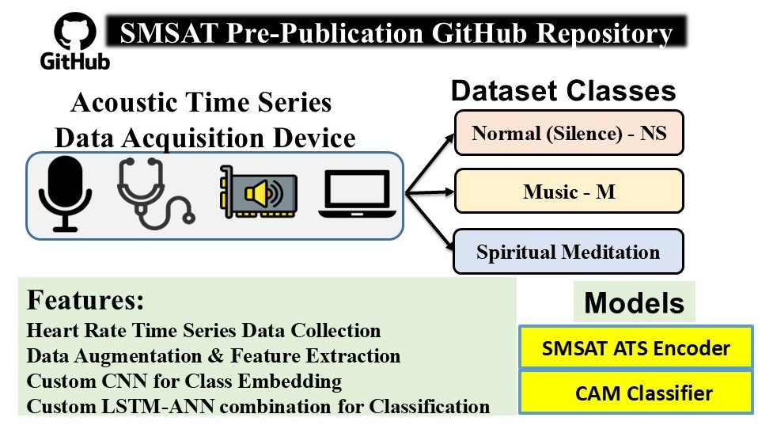

# SMSAT-Time-Series-Acoustic-Data

> ⚠️ This is a **pre-publication** repository for our upcoming paper on heart rate time series classification using custom CNN-based architectures. The full codebase will be released upon acceptance of the manuscript.

---

## 🩺 Project Overview

This project explores the classification of **heart rate audio signals** using a **custom Convolutional Neural Network (CNN)** architecture specifically designed for 1D time-series acoustic data. The goal is to improve classification accuracy on complex heart sound patterns through a novel representation and model training strategy.

The study is based on a **custom heart rate time series dataset** captured from real-world acoustic recordings, with preprocessing and exploratory analysis included.

---

## 🔍 Dataset

A custom dataset of heart rate time series captured as acoustic signals. It includes **normal**, **abnormal**, and **borderline** cases, with accompanying metadata for classification purposes.

📁 **Dataset Access**: 
🔗 [https://www.kaggle.com/datasets/crdkhan/qmsat-dataset/data](https://www.kaggle.com/datasets/crdkhan/qmsat-dataset/data) 
📈 **Raw Data Analysis Notebook**:  
🔗 [https://www.kaggle.com/code/crdkhan/1-dataset-rawaudioanalysis](https://www.kaggle.com/code/crdkhan/1-dataset-rawaudioanalysis)

---

## 🧠 Key Features

- End-to-end pipeline for preprocessing acoustic heart rate signals.
- Custom CNN architecture optimized for 1D acoustic time series.
- Early results show strong improvements in classification accuracy over traditional 1D CNNs.
- Spectrogram and waveform visualizations included.

---

## 🧪 Status

- ✅ Dataset preprocessing complete  
- ✅ Exploratory data analysis (EDA) notebook available on Kaggle  
- 🚧 Model training and evaluation code (coming soon)  
- 📝 Paper under review

---

## 📄 License

This repository will be licensed under the **MIT License** upon release.

---

## ✉️ Contact

For collaboration or questions, please reach out via:  
📧 **engineersuleman118@gmail.com**

---

